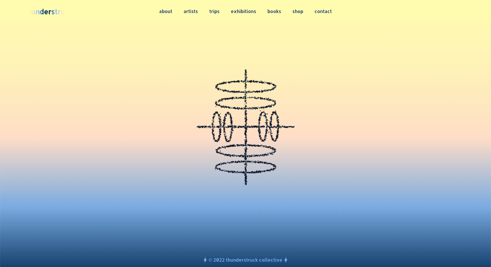

# 
 ⚡ **Thunderstruck** ⚡ 

_July 31, 2022_

#### _React portfolio website for the Thunderstruck artist collective_

#### By _**John Whitten**_

## Table of Contents

1. [Description](#description)
2. [Technologies Used](#technologies)
3. [Setup/Installation Requirements](#setup)
4. [Known Bugs](#bugs)
5. [Contact Information](#contact)
6. [License](#license)

## Description 
My capstone project for Epicodus is a polished, professional, interactive, responsive, and accessible front-end portfolio site with images, animations, and more for the Thunderstruck Collective, which is an ongoing nomadic artist residency I co-founded in 2018 consisting of desert expeditions, art exhibitions, and publications by 9 artist participants.

#### _MVP_
- Multi-page site
- Image carousel galleries
- Include animated flipbook of Thunderstruck books

#### _Further Exploration / Stretch Goals_
- Mobile responsive site
- Interactive particle image on home page
- Contact Form that sends email
- Successfully deployed to GitHub pages with www.thunderstruckcollective.com domain
- Ecommerce connected to Shop page Checkout

<!-- ## Website Components Planning -->

## Technologies Used 
* React
* JavaScript/JSX
* Bootstrap
* CSS
* Material UI
* NodeMailer
* NPM
* Particle Image
* React Page Flip
* Swiper
* Webpack

## Project Setup/Installation Instructions 
* Navigate to the directory in which you would like to clone this project.
* Run `git clone https://github.com/johnwhittenstudio/thunderstruck.git` in terminal.
* Run `cd thunderstruck` to navigate into new project directory.
* Open the cloned repo in a text editor of your choice.
* Run `npm install --legacy-peer-deps` to download all dependencies.
* Run `npm run build` to build project.
* Run `npm run start` to start a live server and view project in the browser.

## Known Bugs 
- _Contact Form doesn't yet successfully send email_
- _Ecommerce not yet connected to Shop page Checkout_

## License 
Copyright (c) 2022 _**John Whitten**_

## Contact 
John Whitten [Email](mailto:johnwhitten.studio@gmail.com) • [LinkedIn](https://www.linkedin.com/in/johnwhitten-studio/) • [GitHub](https://github.com/johnwhittenstudio)